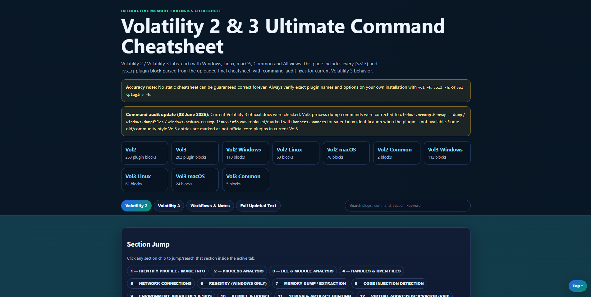

# Volatility 2 & 3 Ultimate Interactive Cheatsheet

Interactive Volatility 2 and Volatility 3 cheatsheet for DFIR, Memory Forensics and CTF players.

## Features

* Volatility 2
* Volatility 3
* Windows plugins
* Linux plugins
* macOS plugins
* Search support
* Copy-to-clipboard buttons
* Mobile responsive UI
* Workflow notes
* Troubleshooting section

## Live Demo

https://ibrahim119532.github.io/volatility-cheatsheet/

## Screenshot

## License

© 2026 MD. Ibrahim Khalilullah

All Rights Reserved.

This repository and its contents are provided for viewing and educational purposes only.

Unauthorized copying, redistribution, modification, rebranding, or commercial use is prohibited without prior written permission.

